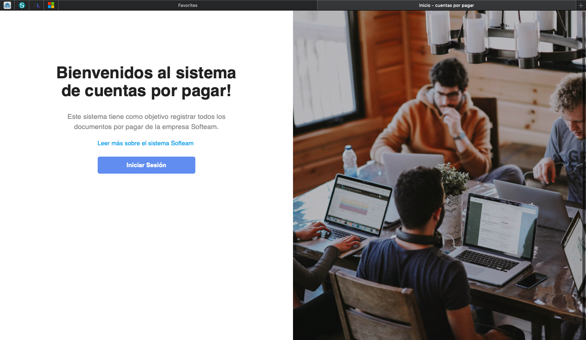
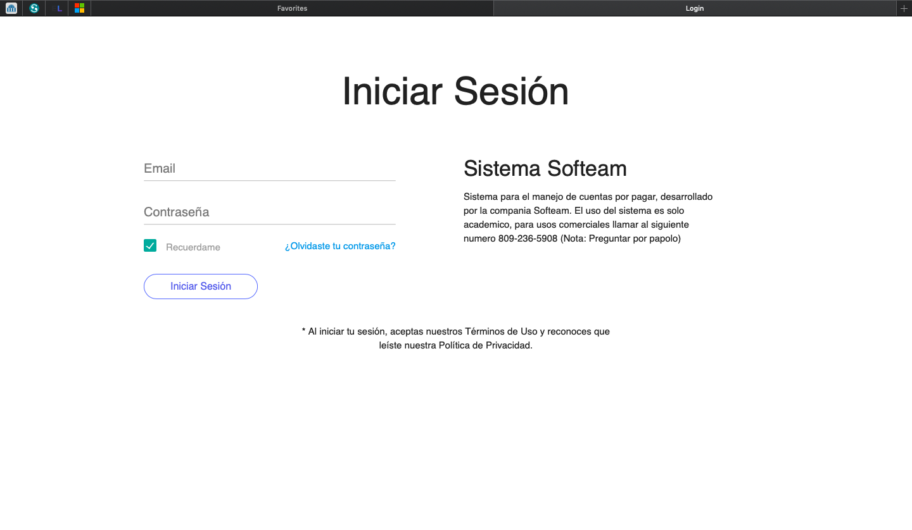

# Gestión de compras
<h1 style="font-family: Arial; text-align: center">Cuentas por pagar</h1>
<h2>Descripción</h2>  
     
 

Este sistema tiene como objetivo controlar las cuentas por pagar de una determinada empresa, integrándose con el sistema de contabilidad

<h2>Tecnologias usadas<h2>
  <h3 style="display: inline; font-family: Arial">Lenguaje de programación:</h3>
 
  

  <ul> 
    <li>Javascript</li>
  </ul>
  

 

 
 <h3 style="display: inline; font-family: Arial">Framework:</h3>
  
  
 
    <ul>
      <li>Vue.js</li>
      <li>Materializecss</li>
    </ul>
  

  
  <h3 style="display: inline; font-family: Arial">Librerias:</h3>
  
  
 
    <ul>
       <li>JQuery</li>
    </ul>
  

  
  <h3 style="display: inline; font-family: Arial">APIs:</h3>
  
  
 
    <ul>
      <li>Morris.js</li>
    </ul>
  

  
 <h3 style="display: inline; font-family: Arial">Lenguajes de Presentación:</h3>
  
  
 
    <ul>
      <li>html</li>
      <li>css</li>
    </ul>
  

   
  <h3 style="display: inline; font-family: Arial">Entorno de desarrollo:</h3>
  
  
    <ul>
       <li>VS Code</li>
    </ul>
  
    

<h1>Gif de la aplicacion en funcionamiento</h1>
  
Flujo basico del sistema, iniciando sesión,  mostrando las estadisticas y las cuentas por pagar

  
 

<h3>Algunas validaciones del sistema</h3>

 
    <ul>
      <li>Validación de cedula</li>
       <li>Manejo de Roles</li>
      <li>Manejo de filtros y autorizaciones</li>
      <li>Campos no vacios</li>
    </ul>
 

<h1>Screenshots de la aplicación</h1>

<h3 style="display: inline; font-family: Arial">Pantalla inicial</h3>
 

<h3 style="display: inline; font-family: Arial">Pantalla de login</h3>
 

<h3 style="display: inline; font-family: Arial">Dashboard </h3>
 

 

<h3 style="display: inline; font-family: Arial">Menu principal</h3>
 

<h3 style="display: inline; font-family: Arial">Vista de conceptos de pago</h3>
 

<h3 style="display: inline; font-family: Arial">Vista de documentos por pagar</h3>
 

 

<h3 style="display: inline; font-family: Arial">Creación de tipo de persona</h3>
 

 

Estas son algunas capturas del sistema, el mismo tiene otras funcionalidas no detallas en el readme

